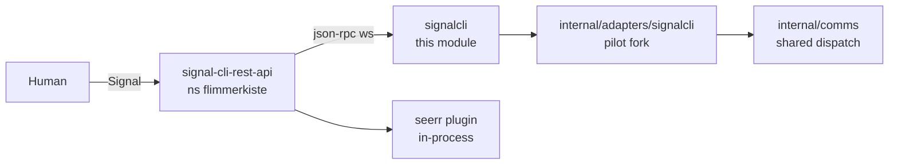
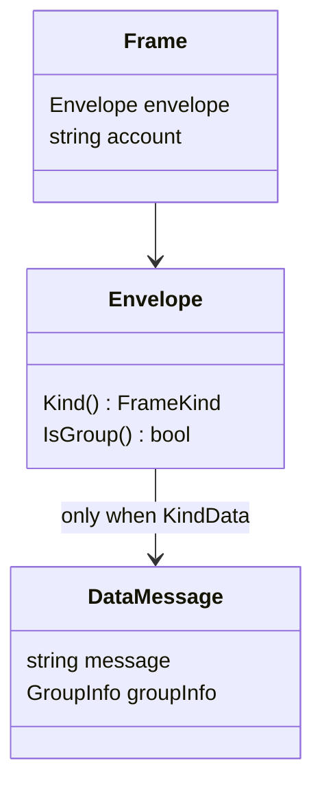

# Architecture

## Context

The module owns transport and parsing. The fork's shim owns `comms.Messenger` and the
handler. The seerr plugin runs inside signal-cli-rest-api, not as a rival websocket
client — so an external consumer does not contend with it.

## Why the dependency inverts

Pilot has no plugin seam, and its adapters live under `internal/`. Go forbids external
modules from importing those, so this module can never import pilot; the fork imports
this. That keeps the bulk of the code off a branch that rebases daily, and testable
without a cluster.

Enforced in three layers: Go's `internal/` rule, `depguard`, and a CI check over the
resolved module graph.

## Receive semantics

Confirmed against the live deployment, not inferred from docs. Each one is a trap:

| Behaviour | Consequence |
|---|---|
| Most frames are `typingMessage` / `receiptMessage` | Select `KindData`; never assume a frame is a command |
| Sent messages are not echoed back | The adapter cannot observe its own output |
| Messages drop while no client is attached | Every restart is a loss window — reconnect is correctness, not polish |

`RECEIVE_WEBHOOK_URL` is the upstream's durable alternative to the websocket. Under
evaluation; unverified for external targets.

## Frame model

`Kind()` discriminates on which payload field is populated; `KindUnknown` covers frame
types not yet modelled, which the stream will produce.

## Status

Envelope model and fixtures are real, captured from live traffic. Transport, send path,
and the shim are not written. Tracked in Linear under
[Signal CLI](https://linear.app/h-cloud/project/signal-cli-01bb0f6119b6).
